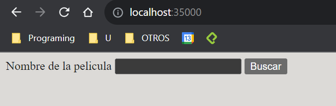
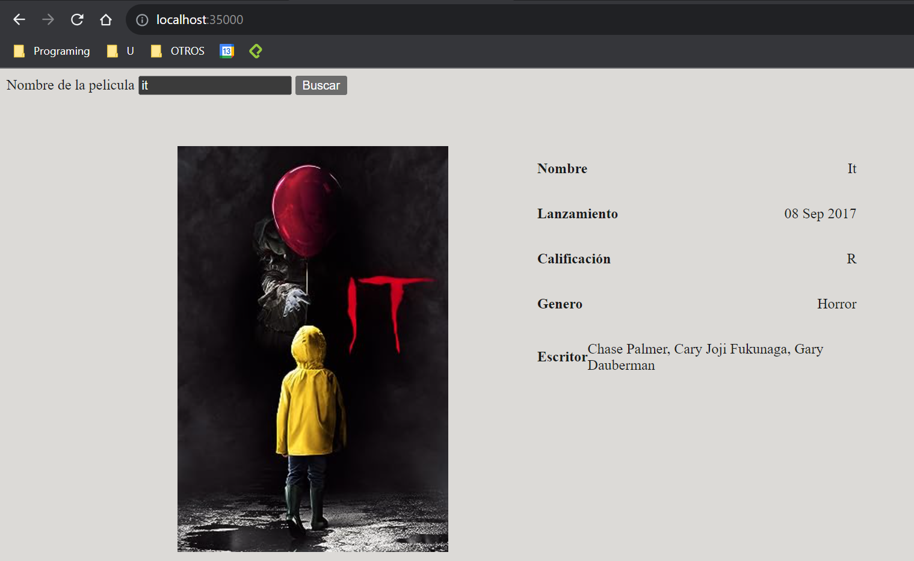
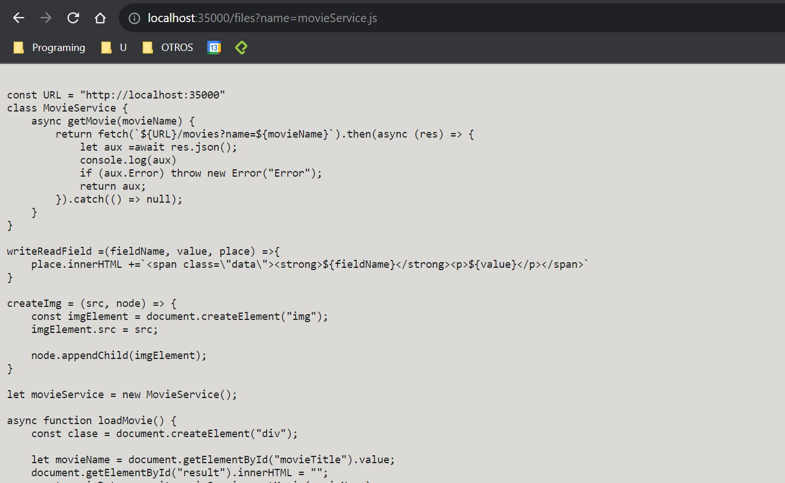
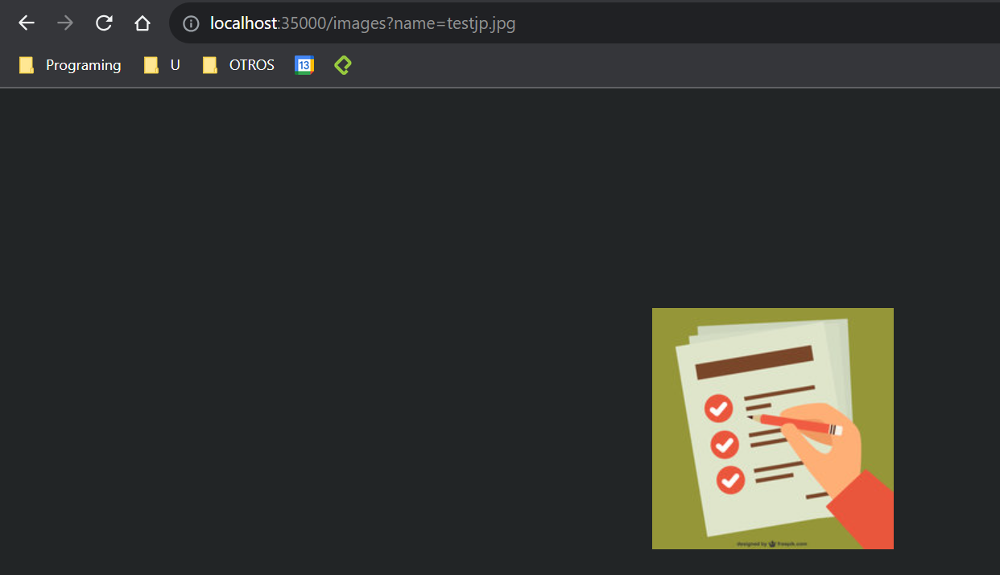

# Laboratory 2

Implementation about a clone of spring. 

## Arquitecture

How it works? Spring class starts a socket server, and read all classes using `ComponentLoader` class, and map only that have `@Componente` annotation. and read the methods that have `@GetMapping` annotation and map it.

For use this clone, you have to execute `Spring.start()` in your class, and add the annotations:

### Annotations

**@Componente** Use this annotation over the class to indicate that this class will be a REST API

**@GetMapping** Use this annotation over the mehtods of the previous class that you want to works like and endpoint. Each method must return `byte[]` and must be `static`

If your method has parameters, you must to use **@RequesParam** in the declaration of your parameter. On the request you have to send a queryParam with the same name that is shown into method. 


On the next we will show a short example:

```java
@Componente
public class HelloServices {
    ...
    @GetMapping("/myendpoint")
    public static byte[] hola(@RequestParam() String arg){
        return arg.getBytes();
    }
}
```


And write in something class:

```java
Spring.start()
```

## Instalation

You must to have a SDK and maven. Then you have to download this folder and run:

```cmd
mvn package -Dskiptests
```

## Execution

1. Run the server. For this run the next command

```cmd
mvn compile exec:java
```

## Evidences

In this case, i didn't do unit tests because unique methods that could have an unit test are private. If I change it to public, it would be incorrect because SOLID principles doesn't approve it.


Instead of, I'll show you evidences about implementation of spring in a personal project. Because if i don't do this, the qualifier will say *It's incorrect*

**http://localhost:35000/**





**http://localhost:35000/files?name=movieService.js**



**http://localhost:35000/images?name=testjp.jpg**



## Author

Juan Pablo Fonseca


